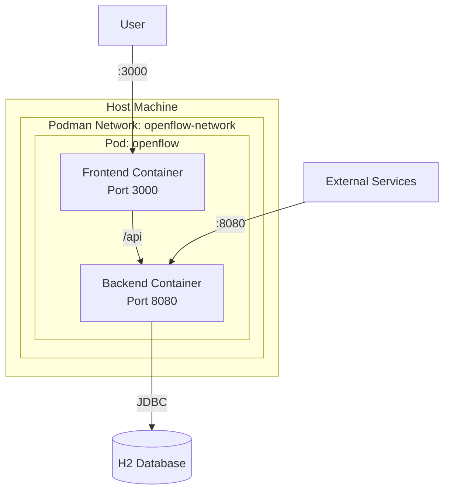
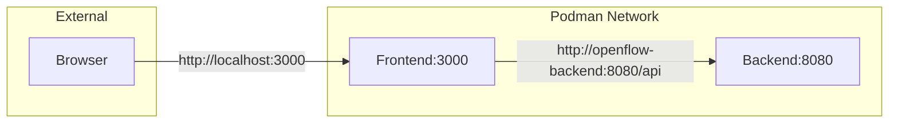
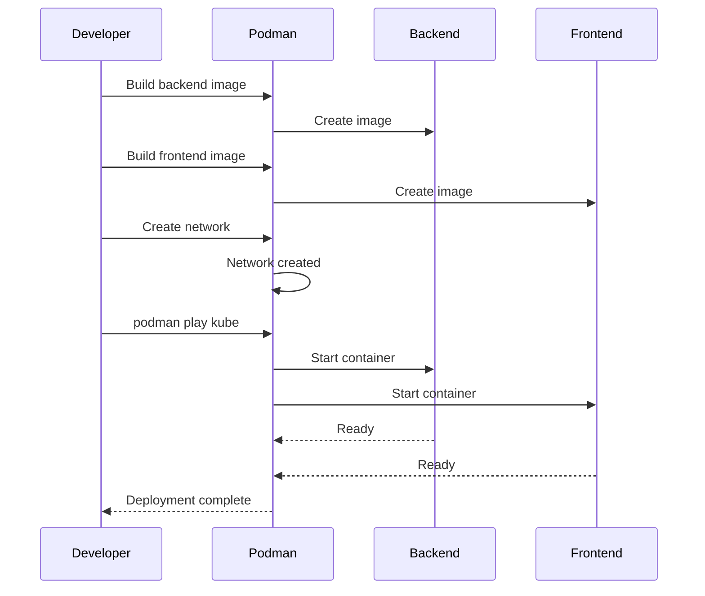

# Deployment Architecture

## File Structure

```
openflow-deployment/
├── kube.yaml              # Podman play kube configuration
├── docs/                  # Deployment documentation
│   ├── overview.md
│   ├── architecture.md
│   ├── installation.md
│   ├── integration.md
│   └── workflows.md
└── README.md
```

## Deployment Architecture



## Service Configuration

### Backend Service

**Container**: `openflow-backend:latest`
**Port**: 8080
**Environment Variables**:
- `SPRING_DATASOURCE_URL`: Database connection string
- `JWT_SECRET`: Secret key for JWT tokens
- `CORS_ALLOWED_ORIGINS`: Allowed CORS origins

**Resources**:
- Requests: 512Mi memory, 250m CPU
- Limits: 1Gi memory, 500m CPU

### Frontend Service

**Container**: `openflow-frontend:latest`
**Port**: 3000
**Environment Variables**:
- `VITE_API_BASE_URL`: Backend API base URL

**Resources**:
- Requests: 128Mi memory, 100m CPU
- Limits: 256Mi memory, 200m CPU

## Network Architecture



## Service Discovery

- Services communicate via container names
- Backend accessible as `openflow-backend` within network
- Frontend accessible as `openflow-frontend` within network
- External access via host ports

## Port Mapping

| Service | Container Port | Host Port | Protocol |
|---------|---------------|-----------|----------|
| Backend | 8080 | 8080 | HTTP |
| Frontend | 3000 | 3000 | HTTP |

## Resource Management

### Memory Limits
- Backend: 1Gi maximum
- Frontend: 256Mi maximum
- Total: ~1.25Gi per pod

### CPU Limits
- Backend: 500m (0.5 CPU cores)
- Frontend: 200m (0.2 CPU cores)
- Total: ~0.7 CPU cores per pod

## Deployment Flow




