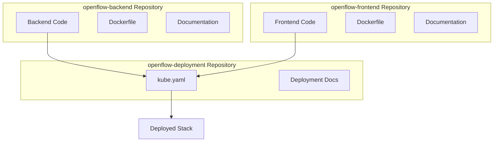
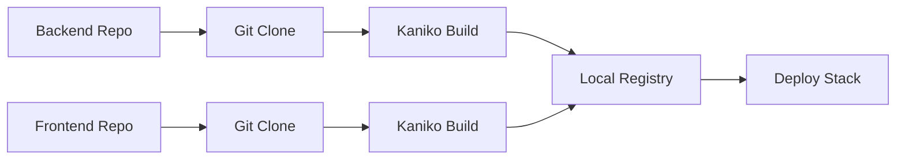

# Integration Guide

## Repository Integration

This repository orchestrates the integration of two independent repositories:
- `openflow-backend`: Spring Boot REST API
- `openflow-frontend`: React single-page application

## Integration Architecture



## Integration Process

### Automatic Build from Git Repositories

The `kube.yaml` file automatically builds images from the Git repositories. The build jobs:

1. Clone the backend and frontend repositories from GitHub
2. Build Docker images using Kaniko
3. Push images to a local registry
4. Deploy the applications using those images

### Configuration

Repository URLs and branches are configured in a ConfigMap:

```yaml
BACKEND_REPO_URL: "https://github.com/DiegoBarrosA/openflow-backend.git"
FRONTEND_REPO_URL: "https://github.com/DiegoBarrosA/openflow-frontend.git"
BACKEND_BRANCH: "main"
FRONTEND_BRANCH: "main"
```

To use different repositories or branches, update the `build-config` ConfigMap in `kube.yaml`.

### Step 1: Deploy Stack

The deployment automatically builds images from the repositories:

```bash
cd openflow-deployment
podman network create openflow-network
podman play kube --network openflow-network --publish 8080:8080 --publish 3000:3000 kube.yaml
```

The build jobs will:
- Clone the repositories
- Build the images
- Push to local registry
- Deploy the applications

### Manual Build (Alternative)

If you prefer to build images manually before deployment:

```bash
# Backend
cd openflow-backend
podman build -t openflow-backend:latest .

# Frontend
cd openflow-frontend
podman build -t openflow-frontend:latest .
```

Then modify `kube.yaml` to remove the build jobs and reference pre-built images.

## Service Communication

### Frontend to Backend

Frontend communicates with backend via:
- **Development**: `http://localhost:8080/api`
- **Production**: `/api` (proxied by Nginx)

### Nginx Proxy Configuration

The frontend's `nginx.conf` proxies `/api` requests:

```nginx
location /api {
    proxy_pass http://openflow-backend:8080/api;
    proxy_set_header Host $host;
    proxy_set_header X-Real-IP $remote_addr;
    proxy_set_header Authorization $http_authorization;
    proxy_pass_header Authorization;
}
```

## Environment Variables

### Backend Variables

| Variable | Description | Example |
|----------|-------------|---------|
| `SPRING_DATASOURCE_URL` | Database connection | `jdbc:h2:mem:openflowdb` |
| `JWT_SECRET` | JWT signing secret | `your-secret-key` |
| `CORS_ALLOWED_ORIGINS` | Allowed CORS origins | `http://localhost:3000` |

### Frontend Variables

| Variable | Description | Example |
|----------|-------------|---------|
| `VITE_API_BASE_URL` | Backend API URL | `/api` |

## Network Configuration

### Podman Network

Services communicate via Podman network:
- Network name: `openflow-network`
- Service discovery: Container names resolve to IPs
- Backend accessible as: `openflow-backend`
- Frontend accessible as: `openflow-frontend`

### Port Exposure

- Backend: Host port 8080 → Container port 8080
- Frontend: Host port 3000 → Container port 3000

## CI/CD Integration

### Build Workflow



### Deployment Workflow

1. Build jobs clone repositories from GitHub
2. Kaniko builds images from cloned repositories
3. Images are pushed to local registry
4. Deployments pull images from local registry
5. Stack is deployed

### Using Different Repositories

To use different repositories or branches, update the `build-config` ConfigMap:

```yaml
apiVersion: v1
kind: ConfigMap
metadata:
  name: build-config
data:
  BACKEND_REPO_URL: "https://github.com/your-org/your-backend.git"
  FRONTEND_REPO_URL: "https://github.com/your-org/your-frontend.git"
  BACKEND_BRANCH: "develop"
  FRONTEND_BRANCH: "develop"
```

## Version Management

### Image Tagging Strategy

- `latest`: Latest development build
- `v1.0.0`: Versioned releases
- `v1.0.0-{commit-hash}`: Specific commit builds

### Updating Images

```bash
# Pull latest images
podman pull registry/openflow-backend:latest
podman pull registry/openflow-frontend:latest

# Restart pod with new images
podman pod stop openflow
podman play kube --network openflow-network kube.yaml
```

## Health Checks

### Backend Health

```bash
curl http://localhost:8080/api/auth/login
```

### Frontend Health

```bash
curl http://localhost:3000
```

### Full Stack Health

1. Frontend loads successfully
2. Login page displays
3. Can authenticate
4. Can access boards
5. API calls succeed

## Troubleshooting Integration

### Frontend Can't Reach Backend

1. Verify both containers in same network
2. Check backend container name matches `kube.yaml`
3. Verify Nginx proxy configuration
4. Check backend is listening on port 8080
5. Review container logs

### CORS Errors

1. Verify `CORS_ALLOWED_ORIGINS` in backend
2. Check frontend origin matches
3. Verify Nginx proxy headers
4. Review browser console for errors

### Authentication Issues

1. Verify JWT secret matches
2. Check token storage in frontend
3. Verify token format
4. Check token expiration
5. Review authentication flow

## Integration Testing

### Manual Testing

1. Deploy stack
2. Access frontend
3. Register new user
4. Create board
5. Create status
6. Create task
7. Drag task between statuses
8. Verify persistence

### Automated Testing

Create integration tests that:
- Deploy stack
- Test API endpoints
- Test frontend functionality
- Verify integration points
- Clean up after tests


