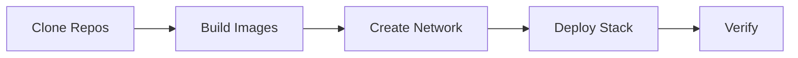
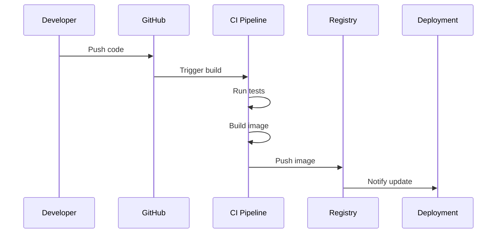

# Deployment Workflows

## Standard Deployment Workflow

### Initial Deployment



1. Clone all three repositories
2. Build backend image
3. Build frontend image
4. Create Podman network
5. Deploy using `kube.yaml`
6. Verify deployment

### Update Deployment

1. Pull latest code from repositories
2. Rebuild images
3. Stop existing pod
4. Deploy updated stack
5. Verify updates

## CI/CD Workflow

### Backend CI/CD



### Frontend CI/CD

Similar workflow to backend:
1. Code push triggers CI
2. Tests run in container
3. Build production bundle
4. Build container image
5. Push to registry
6. Deployment repo pulls and deploys

### Deployment CI/CD

1. Monitor backend and frontend registries
2. Pull updated images
3. Run integration tests
4. Deploy to staging
5. Run smoke tests
6. Deploy to production

## Development Workflow

### Local Development

1. Run backend locally: `mvn spring-boot:run`
2. Run frontend locally: `npm run dev`
3. Test integration
4. Build images when ready
5. Test containerized deployment

### Testing Deployment

1. Build images locally
2. Deploy using `kube.yaml`
3. Test full stack
4. Verify all features
5. Check logs for issues

## Production Deployment

### Pre-Deployment Checklist

- [ ] Backend images built and tagged
- [ ] Frontend images built and tagged
- [ ] Database configured
- [ ] Environment variables set
- [ ] Secrets configured
- [ ] Network created
- [ ] Resource limits reviewed
- [ ] Monitoring configured

### Deployment Steps

1. Backup current deployment
2. Pull latest images
3. Update `kube.yaml` if needed
4. Deploy new stack
5. Run health checks
6. Monitor logs
7. Verify functionality
8. Rollback if issues

### Rollback Procedure

1. Stop current pod
2. Identify previous working version
3. Pull previous images
4. Deploy previous version
5. Verify rollback success

## Monitoring Workflow

### Health Monitoring

```bash
# Check pod status
podman pod ps

# Check container status
podman ps

# View logs
podman pod logs openflow

# Check resource usage
podman stats
```

### Log Monitoring

- Backend logs: Application and error logs
- Frontend logs: Nginx access and error logs
- Integration logs: Service communication

### Performance Monitoring

- Response times
- Resource usage
- Error rates
- API call success rates

## Maintenance Workflow

### Regular Maintenance

1. Update base images
2. Update dependencies
3. Review security patches
4. Optimize resource usage
5. Clean up old images

### Backup Workflow

1. Export database
2. Backup configuration
3. Tag current images
4. Document current state

### Update Workflow

1. Test updates in staging
2. Schedule maintenance window
3. Deploy updates
4. Verify functionality
5. Monitor for issues

